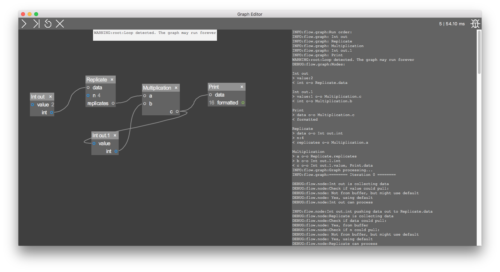

# Flow
Flow based programming with an optional GUI for fast prototyping, visualizing calculations and processing, etc.

### Author
Niklas Beuster -- niklas.beuster@tu-ilmenau.de




## Getting started
Clone the repository and change to that directory. 

Optionally, install the package using `pip install .` or `pip install --user .`

No dependencies needed, even for the GUI.
Runs on Python 2 and 3 and macOS, Linux and Windows.

#### Backend
To test a graph from file using [graph](flow/graph.py) and [node](flow/node.py) without the GUI, run [test_graph.py](test_graph.py) with a graph file as argument:

`python test_graph.py examples/loop.json`

A more comprehensive example where new node classes are created and mixed with nodes from the package and connected in an ad-hoc graph can be found in [test_mix.py](test_mix.py):

`python test_mix.py`

#### GUI
To use the [GUI](flow/gui.py), run [test_gui.py](test_gui.py):

`python test_gui.py`

Open and save graphs (*.json* files, see [examples](examples/)) using the **File menu**.
You can add nodes by **right-clicking** on the dark background and choose a node from the tree.
**Scroll** on the dark background to zoom and **Left drag** to pan the graph.
Add more nodes and connect them or test what happens when you just hit the **run** button (the triangle without the pipe).
When something seems broken, click the **step** button (triangle with pipe) to stop and step through the graph.
You can click the **log** button (the bug) and step or run again to get detailed informations.
You can reset or clear a graph using the other buttons.
Press the **spacebar** or right click and choose "Search..." to search for nodes in the database.

#### Porttypes
The port types are just a rough orientation for the user when to connect nodes.
Knowing if nodes can connect beforehand is impossible because beside the datatype, there would be other conditions why data could be incompatible, e.g. length of an vector, shape of tensors, etc.
It would also be too restrictive to allow only same datatypes to connect, because a node could iterate over tuples and lists just fine for example.

What they **do**:
- Specify the port [color](flow/gui.py)
- Defines the GUI widgets as an interface for the user to input default values
	- For `float` and `int`, the user can click and **drag** the inputs title to enter values more convenient
	- For `file`, the user can **left-click** for an open file dialog and **right-click** for a save file dialog
	- For `bool`, there is a checkbox
- Warn the user when connecting port of different type

What they do **not**:
- Care about incompatible data processing


## Making a new node
You can either add a new node to an existing module or even create your own module.
Either case, writing a new node class is the same.

Here's the most simple node you can make:

```python
from flow.node import Node
class MyNode(Node):
	def __init__(self):
		Node.__init__(self, 'Useless')
		self.addInput('a')
		self.addOutput('b')
	
	def process(self, a):
		self.output['b'].push(a)
```

This node will just forward any data it gets on input a to output b.
Here is a better example:

```python
from flow.node import Node, Ptype

class MyNode(Node):
	def __init__(self):
		super(MyNode, self).__init__('My nodes name')
		# add some inputs, but at least 1
		self.addInput('someInput') # no spaces allowed for input names
		self.addInput('other', 3.0) # default defines porttype automatically
		self.addInput('bla', ptype=Ptype.BOOL) # no default, but type specified
		# add some outputs, but at least 1
		self.myOut = self.addOutput('out', Ptype.STR) # string type specified
	
	def process(self, someInput, other, bla):
		# process inputs
		result = '{}, {}, {}'.format(someInput, other, bla)
		# push results
		self.myOut.push(result)
```

This node will format all inputs in a string which is pushed out from the output.
For more examples, have a look at the already existing [nodes](flow/nodes/).

#### Hints
- Only **[JSON](https://www.w3schools.com/js/js_json_datatypes.asp) compatible default values** must be passed as default values! For other porttypes, specify the `ptype` argument, e.g. ptype=Ptype.COMPLEX.
- When calling `addInput`/`addOutput` an input/output object will be returned, so it can be stored in a class variable like in the second example, or via the `self.input`/`self.output` dictionaries using the corresponding name as key.
- In order to load the node in the GUI, two things are of importance:
	- The line `Node.__init__(self, 'My nodes name')` or `super(MyNode, self).__init__('My nodes name')` (you can use single or double quotes for the name)
	- The class needs to be importable from the [nodes](flow/nodes/) directory in the package.
- When an output is connected to **more** than one input, a deep copy of the data is automatically passed to each extra connected input. This may be a performance loss, but prevents a lot of trouble if data is of reference type and is intuitive for the user.

#### Make a new module or package
When making a bunch of new node classes that are needed in a specific field (e.g. plotting, signal processing, device controls, ...) it is a good idea to make a new node package.

##### Internal nodes
The root of all internal node modules is [nodes](flow/nodes/).
There could be even packages, which can contain modules, and other packages, to specialize even further.

Let's say we want to make a module `my_fancy_nodes.py` in its own sub-package `my_fancy_lib`:
- Create a folder in `nodes` and name it `my_fancy_lib`.
- Open the `__init__.py` file in `nodes` and add `from . import my_fancy_lib` to the end. Save, close.
- Enter the newly created folder and create a file named `my_fancy_nodes.py`.
- Open the file and write `from flow.node import Node, Ptype`, then add your node class as described above. Save, close.
- Create a `__init__.py` file in the same folder.
- Open the file and write `from . import my_fancy_nodes`. Save, close.

When starting the GUI, it will automatically recognize the new package, the module and all node classes inside.
Right-click in the editor and the pop-up menu will show the newly created hierarchy.

**Tip**: To avoid showing the module, import all node classes in the package, then delete the module like this:
- Open the `__init__.py` file in the `my_fancy_lib` folder.
- Change `from . import my_fancy_nodes` to `from .my_fancy_nodes import *`
- Add a new line with `del my_fancy_nodes`. Save, close.

##### External nodes
In case you don't want to change this project, but be able to make and use more nodes, proceed as follow:
- Simply create one or more node packages as described [above](#internal-nodes), but instead of putting it into `nodes`, put it anywhere outside the project
- In your GUI starter, you need to specify the node package paths you want to load:

	```python
	from flow import gui
	extNodes = ('external_nodes', 'C:/Path/To/other_node_lib') # example node package paths
	gui.startApp(extNodes)
	```

## Concept
The general concept is called *flow based programming* (**FBP**). 
It allows to handle data as if they are signals in the real world by connecting **inputs** and **outputs** of **nodes** together in a **graph**, like connecting devices via cables. 
This makes it intuitive for an end-user to build algorithms without programming. 
It is also useful for fast prototyping because useful code snippets is already there and have to be combined only.

This implementation transports data between the nodes and stores them in the inputs **buffer**. 
The node calls a **process** function when the data is synchronized and **pulled** from the buffer.
Depending on the nodes purpose, processed data is **pushed** to the output(s). 
An output pushes data to all **connected** inputs, where it is queued in their buffers.

Inputs have another data source, the **default** value, which is used for special cases. 
If the input is **disconnected**, i.e. no pipe attached, the default value gets visible in the GUI and the user can enter a value based on the **port type**. 
The default value is used **once** when the input is not connected or when the input is part of a **loop** and no data is in the buffer.
It is also used **always** when other inputs of the node have data in their buffers. 
Users can use this in conjuction with pulling, when input data should be processed synchronized and no pull should be wasted.

Outputs push data to a **result** if the port is not connected. 

#### Why not backward recursion?
A similar concept would be to recursively pull data from the nodes, starting from the sinks, until the sources are reached.
This sounds easy and fast, but there are some **problems** with that concept:

**Interface on output level**:
How would that concept be implemented? Each output would have a pull method, which would get the results from an output specific process method, that would pull from inputs which pull from connected outputs, etc.
The graph would be run be calling the pull method of all sink outputs.
To develop a new node, usually one wants only to implement the purpose, i.e. the processing method of a node.
The problem is, either there is only 1 output allowed to have a node-wide processing method, or each output would need its own process method.
The latter requires to either monkey-patch each created output in a node, or inherit new output classes.

**Synchronizing**:
If there is no node-wide process method, and each output have its own process method, how would input data be handled?
Think about it: the inputs belong to the node, for a user, it is not obvious which inputs are needed for an output.

**Time variance**:
The above problem could only be solved by restricting the graph to only process static data, i.e. the data in the graph must never change.
When multiple outputs pull from the same source, which would change its data, data is not synchronized anymore.
Imagine a node generating a random sample on each pull request.
When multiple connected nodes pull from that noise-generator, the data is not synchronized.